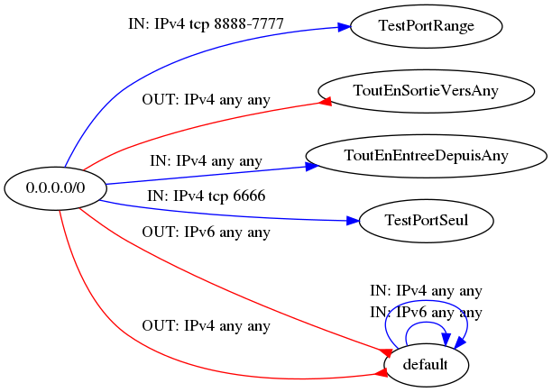

# openstack-securitygroup-grapher

This ansible role gets information from an openstack tenant and generate a [graphical representation](CloudGrapher.png) of security groups and instances through a dot file rendered by [Graphviz](https://graphviz.gitlab.io/)

## Requirements

Shade library needs to be installed, as that is required by the OpenStack Ansible modules.

To render (i.e. to draw and obtain a graphic file), Graphviz needs to be installed.

## Role Variables

| Variable | Content |
| --- | --- |
| **osggrapherCloudInfra** | Name of cloud infrastructure (defined in clouds.yml) where your tenant is. (**mandatory**) |
| osggrapherShowDefault | Do you want to see default security group, default value: false |
| osggrapherShowInstances | Do you want to see instances with their security groups, default value: false |
| osggrapherRankdir | See <https://www.graphviz.org/doc/info/attrs.html#d:rankdir>, default value: LR |
| osggrapherDotFileToRender | Path and name of generated dot file , default value: "./CloudGrapher.dot" |
| osggrapherFileToRender | Path and name of generated image file, default value: "./CloudGrapher.png" |
| osggrapherServerLabel | Title of instances section in security group boxes used when osggrapherShowInstances = true, default value: "Servers" |

## Example Playbook

~~~yaml
---
- name: Security group grapher
  hosts: localhost
  connection: local
  gather_facts: false
  roles:
    - role: openstack-securitygroup-grapher
      osggrapherCloudInfra: MyCloud
~~~

## Examples of generated images

### How to read the graph

Ellipses are *security groups.*

The red arrows represent *egress* flows: for example, the UDP stream 53 is authorized as output of SG-VPC-INTERNAL to 10.xxx.yyy.zza.

The blue arrows represent *ingress* flows: for example, tcp stream 443 is allowed as input of SG-VPC-LB from any (0.0.0.0/0)

The arrow head is always on the security group which contains the rule represented by the arrow.

### Full example

*It shows a tenant with several security groups corresponding to the different functions of the machines present in the project.*

### Simpler example

*It shows in particular a SG that accepts any input from any source and a SG that allows any output to any destination.*

### osggrapherShowDefault

With osggrapherShowDefault: true, you'll have on your graph all the SGs, included the default Openstack SG:

### osggrapherShowInstances

With osggrapherShowInstances: true, you'll have on your graph all the instances (VM) with SGs used by these instances.

### osggrapherRankdir

With osggrapherRankdir: LR, left to right, RL, right to left, TB, top to bottom, BT, bottom to top, you can change the way to draw the graph.

#### LR example

#### TB example

### Author Information

Jean-Louis FEREY
